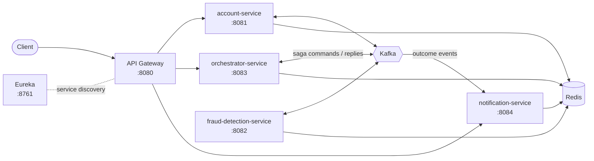

<p align="center">
  
</p>

<p align="center">
  <a href="https://hamouditaha.github.io">
    
  </a>
</p>

<p align="center">
  <a href="https://hamouditaha.github.io"></a>
  <a href="https://linkedin.com/in/tahahamoudi"></a>
  <a href="mailto:tahahamoudi32@gmail.com"></a>
  
  
</p>

---

## 👨‍💻 About me

```java
public class TahaHamoudi {

    String role       = "Full Stack Developer";
    String location   = "Casablanca, Morocco 🇲🇦";
    String education  = "Master's in Software Engineering, Big Data & Cloud Computing — ENSET Mohammedia (2026)";
    int    experience = 3; // years building business web applications

    String[] backend  = {"Java 17", "Spring Boot 3", "Spring Cloud", "Spring Security", "Kafka"};
    String[] frontend = {"Angular", "TypeScript"};
    String[] devops   = {"Docker", "Kubernetes", "Jenkins", "GitHub Actions"};

    String currentFocus = "Migrating monoliths to microservices";
    String learning     = "Generative AI in Java: Spring AI, LangChain4j, RAG, pgvector";
    String[] languages  = {"Arabic", "French", "English"};
}
```

- 🔁 **Latest work:** migrated the **OptiManager** business application from a Laravel monolith to **Spring Boot microservices** (Gateway, Eureka, Config Server, Docker, CI/CD) with an **Angular** front-end, during my final-year internship at HouXplore.
- 🏗️ I enjoy **distributed systems**: event-driven communication, SAGA transactions, idempotency and distributed locking.
- 🤖 Next step: adding **LLM features** (RAG assistants, semantic search) to existing Java products.

---

## 🛠️ Tech stack

<table>
  <tr>
    <td align="center" width="150"><b>Back-end</b></td>
    <td></td>
  </tr>
  <tr>
    <td align="center"><b>Front-end</b></td>
    <td></td>
  </tr>
  <tr>
    <td align="center"><b>Databases</b></td>
    <td></td>
  </tr>
  <tr>
    <td align="center"><b>DevOps & Cloud</b></td>
    <td></td>
  </tr>
  <tr>
    <td align="center"><b>Tools</b></td>
    <td></td>
  </tr>
</table>

<p>
  
  
  
  
  
  
  
  
  
</p>

---

## 🚀 Featured projects

### 🏦 [Banks: Real-time Fraud Detection System](https://github.com/hamouditaha/banks)

Digital banking platform built as **Spring Boot microservices** that communicate over **Kafka**. Money transfers are coordinated by an **orchestration-based SAGA** with compensations. **Redis** serves as the system of record, with atomic Lua debits, idempotent steps and **Redisson** distributed locks.



`Spring Boot` `Spring Cloud Gateway` `Eureka` `Kafka` `Redis` `Redisson` `SAGA` `Docker Compose`

<table>
  <tr>
    <td width="50%" valign="top">
      <h4>👥 <a href="https://github.com/hamouditaha/gestion-RH">HR Management: QR attendance &amp; payroll</a></h4>
      Employees clock in with a <b>QR code</b>. The app tracks attendance, absences and late arrivals, <b>computes monthly salaries</b> and <b>e-mails payslips</b>. Scheduled jobs mark absences automatically.
      <br/><br/>
      <code>Spring Boot</code> <code>Angular 17</code> <code>MySQL</code> <code>ZXing</code> <code>Thymeleaf</code>
    </td>
    <td width="50%" valign="top">
      <h4>🛒 <a href="https://github.com/hamouditaha/e-commerce_Microservices">E-commerce Microservices</a></h4>
      Microservices e-commerce platform, <i>in progress</i>: Docker Compose infrastructure (PostgreSQL, MongoDB, Kafka, Zipkin) and a product service with Flyway migrations.
      <br/><br/>
      <code>Spring Cloud</code> <code>Kafka</code> <code>PostgreSQL</code> <code>Docker</code>
    </td>
  </tr>
  <tr>
    <td width="50%" valign="top">
      <h4>🏨 <a href="https://github.com/hamouditaha/hotel-management">Hotel Management System</a></h4>
      Desktop app for hotel reception: rooms, customers, check-in and check-out, staff and pick-up service.
      <br/><br/>
      <code>Java Swing</code> <code>JDBC</code> <code>MySQL</code>
    </td>
    <td width="50%" valign="top">
      <h4>📦 <a href="https://github.com/hamouditaha/ProductManager">Product Manager</a></h4>
      Desktop product catalogue with CRUD operations and live statistics, built on the MVC pattern.
      <br/><br/>
      <code>JavaFX</code> <code>FXML</code> <code>Maven</code>
    </td>
  </tr>
  <tr>
    <td width="50%" valign="top">
      <h4>🧩 <a href="https://github.com/hamouditaha/design-patterns-builder-singleton-prototype">Design Patterns in Java</a></h4>
      Builder, thread-safe Singleton and Prototype (deep clone) patterns applied to a banking domain.
      <br/><br/>
      <code>Java 17</code> <code>Maven</code> <code>Jackson</code>
    </td>
    <td width="50%" valign="top">
      <h4>🌐 <a href="https://hamouditaha.github.io">Portfolio</a></h4>
      My personal website: experience, projects and CV.
      <br/><br/>
      <code>HTML</code> <code>CSS</code> <code>GitHub Pages</code>
    </td>
  </tr>
</table>

---

## 📊 GitHub stats

<p align="center">
  
  
</p>
<p align="center">
  
</p>

<p align="center">
  <picture>
    <source media="(prefers-color-scheme: dark)" srcset="https://raw.githubusercontent.com/hamouditaha/hamouditaha/output/github-snake-dark.svg"/>
    
  </picture>
</p>

---

## 📜 Certifications

<p>
  
  
</p>

---

<p align="center">
  
</p>

<p align="center"><i>💬 Open to Full Stack Java / Spring Boot opportunities — feel free to reach out!</i></p>


